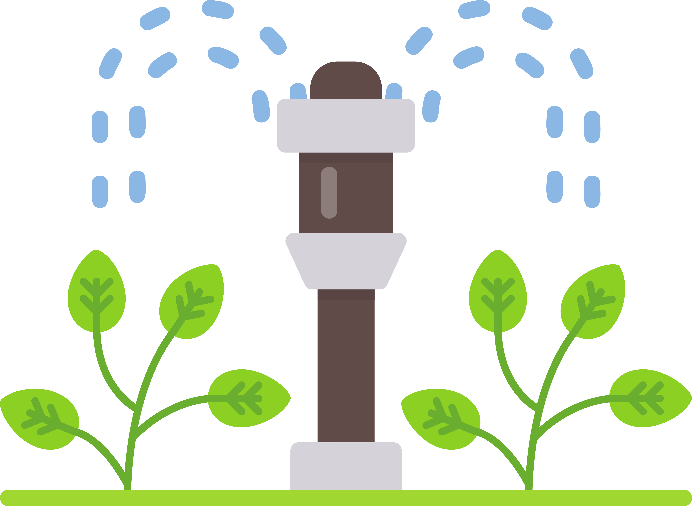

<!-- PROJECT LOGO -->
 

  

<h3 align="center">Sprinkler Library</h3>

  

    Sprinkler Library for Embedded Systems 
        
  

<!-- ABOUT THE PROJECT -->
## About The Project

---

## Table of Contents  

- [Introduction](#introduction)  
- [Features](#features)  
- [System Architecture](#system-architecture)  
- [Usage](#usage)  
- [Troubleshooting](#troubleshooting)  
- [Contributing](#contributing)  
- [License](#license)  

## Introduction  

  

## Features  

  

## System Architecture  

  

## Usage  

  

## Troubleshooting  

  

## Contributing  

Contributions are welcome, especially given the project’s early stage. To contribute:  
- Submit issues or feature requests on the [GitHub Issues](https://github.com/hiperiondev/sprinklerlib/issues) page.  
- Propose code or documentation improvements via pull requests.  
- Engage in discussions on the repository to share ideas.  

  

## License  

Distributed under the MIT License. See `LICENSE` file for more information.  

  

